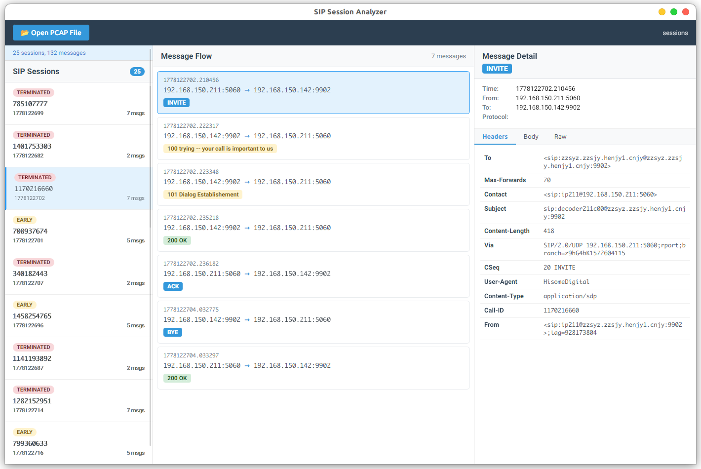

# SIP Session Analyzer

A desktop application for analyzing SIP (Session Initiation Protocol) sessions from pcap/pcapng capture files. Built with Tauri 2.x, Vue 3, and TypeScript.

## Features

- **Session Grouping**: Automatically groups SIP messages by Call-ID to reconstruct complete call sessions
- **Session State Detection**: Identifies session state (Early, Confirmed, Terminated) based on SIP signaling
- **Multi-Format Support**: Reads both pcap and pcapng files
- **Protocol Support**: Handles SIP over UDP and TCP, with support for Ethernet, SLL, and raw IP packet formats
- **Three-Panel UI**: Session list, message flow, and detailed message view
- **Full Message Inspection**: View headers, body, and raw data for any SIP message

## Screenshots

 

## Architecture

### Tech Stack

| Layer | Technology |
|-------|-----------|
| Frontend | Vue 3 + TypeScript + Vite |
| Backend | Rust + Tauri 2.x |
| IPC | Tauri command system with serde serialization |

### Project Structure

```
sip_session/
├── frontend/               # Vue 3 frontend
│   └── src/
│       ├── App.vue         # Three-panel layout
│       ├── components/     # UI components
│       │   ├── Toolbar.vue
│       │   ├── SessionList.vue
│       │   ├── MessageFlow.vue
│       │   └── MessageDetail.vue
│       └── types/
│           └── sip.ts      # TypeScript interfaces
├── src-tauri/              # Rust backend
│   └── src/
│       ├── main.rs         # Entry point
│       ├── lib.rs          # Tauri setup, AppState management
│       ├── commands.rs     # Tauri commands (IPC)
│       └── sip/
│           ├── mod.rs
│           ├── pcap_reader.rs  # Pcap/pcapng file reading
│           ├── parser.rs       # SIP message parsing
│           └── session.rs      # Session grouping & state
└── README.md
```

### Data Flow

1. User selects a pcap file via the file dialog
2. Frontend calls `invoke('open_pcap_file', { path })`
3. Rust backend reads the pcap file, extracts packets, parses SIP messages, groups them into sessions, and stores the result in `AppState`
4. Frontend retrieves sessions via `invoke('get_sessions')` and displays the list
5. Selecting a session or message calls `invoke('get_message_detail', { message_id })` for detailed inspection

## Prerequisites

- **Rust** (latest stable) with Cargo
- **Node.js** (v18+) with npm
- **Tauri 2.x CLI**: `npm install -g @tauri-apps/cli` (or use `npx`)

### Linux Dependencies

On Ubuntu/Debian:

```bash
sudo apt update
sudo apt install libwebkit2gtk-4.1-dev libgtk-3-dev libayatana-appindicator3-dev librsvg2-dev patchelf
```

On Fedora:

```bash
sudo dnf install webkit2gtk4.1-devel gtk3-devel libappindicator3-devel librsvg2-devel patchelf
```

## Getting Started

### Install Dependencies

```bash
# Root level (installs @tauri-apps/cli)
npm install

# Frontend dependencies
cd frontend && npm install
```

### Development Mode

```bash
npm run dev
```

This starts both the Vite dev server and the Tauri application.

### Frontend Only (for UI development)

```bash
cd frontend && npm run dev
```

The frontend will be available at `http://localhost:5173`.

### Production Build

```bash
npm run build
```

This builds the frontend and then bundles everything into a native application via Tauri.

### Rust Development

```bash
cd src-tauri && cargo build    # Debug build
cd src-tauri && cargo check    # Quick type check
```

## Key Commands (Tauri IPC)

| Command | Description |
|---------|-------------|
| `open_pcap_file(path)` | Parse a pcap file and store sessions in state |
| `get_sessions()` | Retrieve all sessions from the current state |
| `get_message_detail(id)` | Get detailed information for a specific message |

## How It Works

### Packet Capture Reading

The `pcap_reader` module reads pcap/pcapng files and extracts SIP payloads from UDP/TCP packets. It handles multiple link-layer types including Ethernet, Linux SLL (cooked capture), and raw IP.

### SIP Parsing

The `parser` module converts raw bytes into structured `SipMessage` structs, extracting:
- Request method or status line
- All SIP headers
- Message body
- Dialog identifiers (Call-ID, From/To tags)

### Session Management

The `session` module groups messages by Call-ID (ignoring dialog tags to group both directions) and determines session state:
- **Early**: INVITE sent, no final response yet
- **Confirmed**: 200 OK received for INVITE
- **Terminated**: BYE or error response received

## Contributing

1. Fork the repository
2. Create a feature branch (`git checkout -b feature/your-feature`)
3. Commit your changes (`git commit -am 'Add some feature'`)
4. Push to the branch (`git push origin feature/your-feature`)
5. Open a pull request

## License

> TODO: Add license information

## Acknowledgments

- [Tauri](https://tauri.app/) - The framework for building tiny, fast binaries for all major platforms
- [Vue 3](https://vuejs.org/) - The progressive JavaScript framework
- [pcap-parse](https://crates.io/crates/pcap-parse) - Rust library for parsing pcap files
